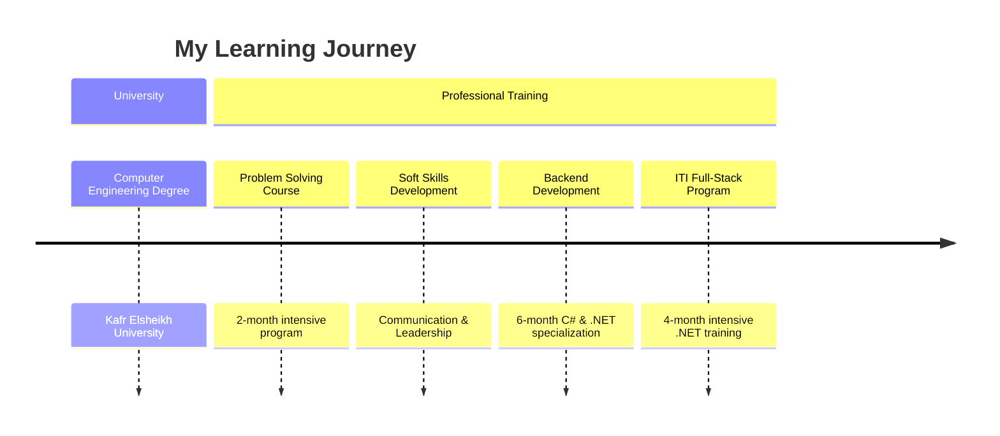

# 👋 Hey there, I'm Omar Gallo!

<div align="center">
  
  

  [](https://www.linkedin.com/in/omar-gallo-023187229/)
  [](mailto:omargallow33@gmail.com)
  [](https://github.com/omargallo)

</div>

## 🚀 About Me

```yaml
name: Omar Gallo
location: Egypt 🇪🇬
age: 24
education: Computer Engineering @ Kafr Elsheikh University
current_focus: Full-Stack .NET Development
passion: ["Clean Code", "Problem Solving", "Teaching", "Game Modding"]
workout_gear: "15kg zigzag bar & dumbbells 💪"
```

🎯 **Computer Engineering graduate** passionate about crafting robust backend systems and intuitive user interfaces. I believe in the power of clean, efficient code and love sharing knowledge with fellow developers.

## 💻 Tech Stack

<div align="center">

### Languages


### Frameworks & Libraries


### Databases


### Tools & Technologies


</div>

## 📈 GitHub Stats

<div align="center">
  
  
  
  
  
  

</div>

## 🎓 Education & Certifications



## 🏆 What I'm Up To

- 🔭 **Currently working on:** Full-stack .NET applications with clean architecture
- 🌱 **Learning:** Advanced design patterns and microservices architecture  
- 👯 **Looking to collaborate on:** Open-source .NET projects
- 🤔 **Seeking help with:** Cloud deployment strategies and DevOps practices
- 💬 **Ask me about:** C#, ASP.NET Core, Entity Framework, or game modding!
- ⚡ **Fun fact:** I can deadlift my own body weight and mod games in my spare time 🎮

## 🎯 Goals for 2025

<div align="center">

| Goal | Status | Progress |
|------|--------|----------|
| 🌟 Contribute to 5+ open-source projects | 🔄 In Progress |  |
| 💪 Maintain consistent workout routine | ✅ On Track |  |
| 🧠 Master advanced problem-solving patterns | 🔄 In Progress |  |
| 🚀 Build a production-ready SaaS application | 📋 Planning |  |

</div>

## 🌟 Beyond Code

When I'm not crafting elegant solutions in C#, you'll find me:

- 🏊‍♂️ **Swimming laps** - My favorite way to debug mentally
- 🏋️‍♂️ **Lifting weights** - Building strength with my trusty 15kg zigzag bar
- 🎮 **Modding games** - Bringing creative ideas to virtual worlds
- 👨‍🏫 **Teaching & mentoring** - Sharing the joy of programming with others

## 📊 Weekly Development Breakdown

```text
C#           ████████████████████░   80% 
JavaScript   ████████░░░░░░░░░░░░░   35%
Learning     ████████████░░░░░░░░░   60%
Teaching     ██████░░░░░░░░░░░░░░░   30%
Game Modding ████░░░░░░░░░░░░░░░░░   20%
```

## 🎵 Currently Vibing To

[](https://open.spotify.com/user/omargallo)

---

<div align="center">
  
  ### 💭 Quote of the Day
  
  *"Code is like humor. When you have to explain it, it's bad."* – Cory House
  
  
  [](https://github.com/omargallo)
  
  **Thanks for stopping by! Let's build something amazing together! 🚀**
  
</div>
